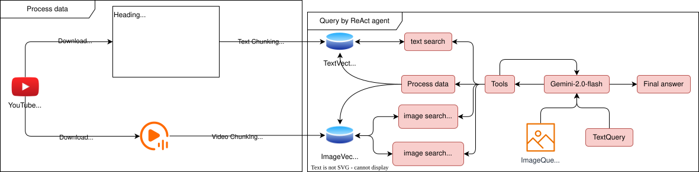

# Video RAG Chatbot

## Flow

Query from ReAct agent

- Tạo một ReAct agent: Cho phép quyết định tool nào được gọi, gọi bao nhiêu lần, dựa vào query
- Tools:
    - `Process data`:
        - Download video và subtitle từ YouTube
        - Chunking subtitle theo từng đoạn thoại --> Nhúng các chunks vào DB
        - Chunking video theo từng khung hình ở giữa đoạn thoại --> Nhúng các frame vào DB kèm theo metadata của từng frame (`timestamp`, `subtitle`, `frame_path`)
    - `text_search`: Áp dụng cho những câu hỏi có thể trả lời bằng `TextVectorDB`. Ví dụ: Brand Apple được nhắc đến lần đầu trong video vào thời điểm nào?
    - `img_search_by_img`: Truy vấn ảnh với một query image
    - `img_search_by_text`: Truy vấn ảnh bằng một mô tả. Ví dụ: Liệt kê các khoảnh khắc có xuất hiện hình ảnh iPhone

## Demo

- Hỏi đáp qua hình ảnh:
    - Input 1 hình ảnh. Prompt: `list out all moments (timestamp, subtitle, path to frame) that are related to this image`
    - Input 1 mô tả hình ảnh. Prompt: `according to the video, list out all moments that are related to or contains the image of an iPhone`

- Hỏi đáp qua phụ đề:
    - `according to the video, what could be addressed if there was something special that you could do on a tablet?`
    - `sample 3 moments that are related to the term "Android tablet"`

<!-- ## Ideas

[*] Viết tool tự động crawl video và subtitle rồi bỏ vào db

- Dùng multimodal embedding để encode 1 pair (img + sub) rồi bỏ vào DB. Tôi không dùng bởi vì nó yêu cầu customize vector db và embedding (mất thời gian và thiếu khả năng mở rộng)
- Dùng multimodal vector db để lưu chung text và img vào cùng 1 db. Embedding builtin của ChromaDB hơi gà và config GoogleAPI để nó đọc được ảnh thì hơi mất thời gian. Tôi dùng text embedding của Google và embedding function của Chroma để encode
- Tách riêng quá trình chunking khỏi quá trình thêm dữ liệu vào db querying
- Deploy

## Problem

- Khi chuyển sang video hoạt hình thì truy vấn embedding không còn tốt nữa -->
